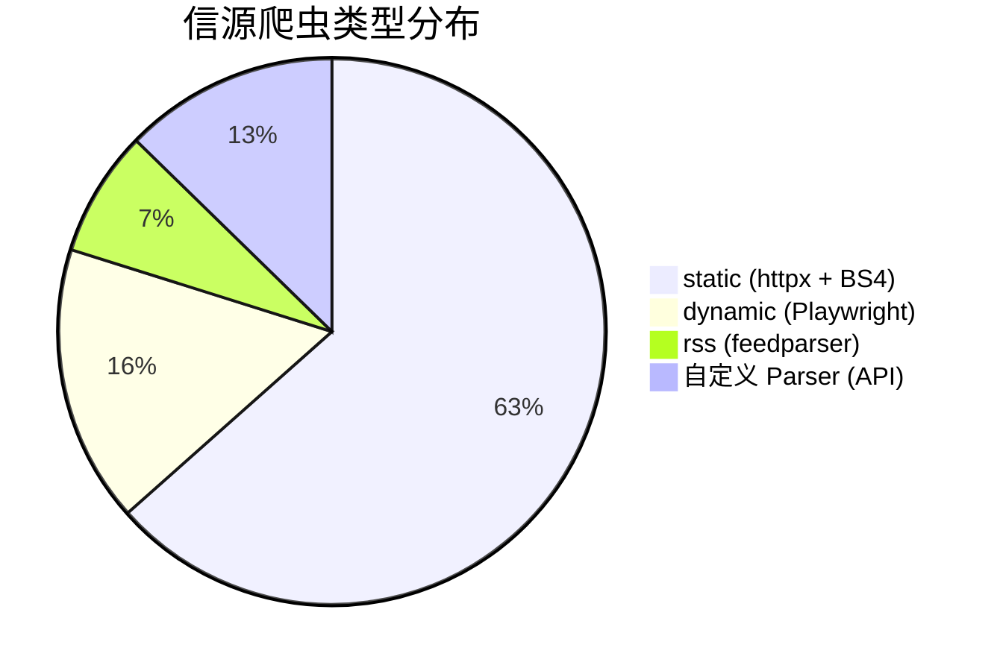
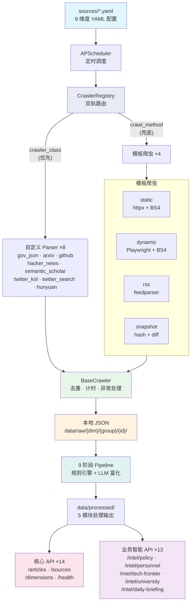

# Information Crawler

中关村人工智能研究院**信息监测系统**。自动爬取 134 个信源（109 启用，横跨 9 个维度），通过 v1 REST API（27 端点，含 intel 业务智能 13 端点）供前端查询，所有数据以本地 JSON 文件存储。
82 个启用信源已配置 `detail_selectors` 或 RSS/API 自带正文，可自动获取文章正文。

**技术栈**：FastAPI · APScheduler 3.x · httpx · BeautifulSoup4 · Playwright · feedparser · 纯 JSON 存储（无数据库）

---

## 部署

**线上环境已部署：**

| 服务 | 地址 |
|------|------|
| 后端 API | <http://43.98.254.243:8001/> |
| API 文档 | <http://43.98.254.243:8001/docs> |
| 前端 (Dean-Agent) | <http://43.98.254.243:8080/> |

```bash
# 一键部署（自动处理 venv、依赖、Playwright、启动）
./deploy.sh

# 或分步操作
./deploy.sh init         # 仅初始化
./deploy.sh start        # 启动服务
./deploy.sh stop         # 停止
./deploy.sh restart      # 重启
./deploy.sh status       # 查看详细状态
./deploy.sh logs -f      # 持续跟踪日志
```

---

## 快速开始（本地开发）

```bash
# 一键初始化 + 启动
./deploy.sh

# 或手动方式
python3 -m venv .venv && source .venv/bin/activate
pip install -e ".[dev]"
playwright install chromium
cp .env.example .env

# 前台启动（开发用）
uvicorn app.main:app --reload
# API 文档 → http://localhost:8000/docs
```

环境要求：Python 3.11+ · Node.js（Playwright 需要）

完整环境变量见 [.env.example](.env.example)。

---

## 问题定位指南

遇到问题时，按下表快速找到对应文件：

### 爬虫问题

| 现象 | 去哪里看 | 怎么测 |
|------|----------|--------|
| **某个信源**抓不到/选择器失效 | `sources/{维度}.yaml` → 该源的 `selectors` / `url` | `python scripts/run_single_crawl.py --source <id>` |
| **static 类型**整体不工作 | `app/crawlers/templates/static_crawler.py` | 同上，选一个 static 源测试 |
| **dynamic 类型**超时/白屏 | `app/crawlers/templates/dynamic_crawler.py` + YAML 中 `wait_for`/`wait_timeout` | 同上，选一个 dynamic 源测试 |
| **rss 类型**解析异常 | `app/crawlers/templates/rss_crawler.py` | 同上 |
| **snapshot 类型**没检测到变化 | `app/crawlers/templates/snapshot_crawler.py` | 同上 |
| **自定义 Parser** 出错（arxiv/github/twitter…） | `app/crawlers/parsers/{name}.py` | 同上 |
| 不知道源用哪个爬虫 | `app/crawlers/registry.py` 的路由映射 | — |

### 基础设施问题

| 现象 | 去哪里看 |
|------|----------|
| HTTP 请求失败 / 被封 / 限速 | `app/crawlers/utils/http_client.py`（重试、UA 轮换、限速） |
| Playwright 浏览器池异常 | `app/crawlers/utils/playwright_pool.py` |
| 文章重复 / 去重失效 | `app/crawlers/utils/dedup.py`（url_hash SHA-256） |
| JSON 文件没输出 | `app/crawlers/utils/json_storage.py` |
| 调度不执行 / 频率不对 | `app/scheduler/manager.py` + YAML 中 `schedule`/`is_enabled` |
| API 返回异常 | `app/api/v1/` 各模块 |

### 调试脚本

| 脚本 | 用途 |
|------|------|
| `scripts/run_single_crawl.py --source <id>` | 隔离测试单个信源 |
| `scripts/run_all_crawl.py` | 批量运行所有启用信源 |
| `scripts/process_policy_intel.py --dry-run` | 政策智能预览 |
| `scripts/process_personnel_intel.py --dry-run` | 人事情报预览 |
| `scripts/process_tech_frontier.py --dry-run` | 科技前沿预览 |
| `scripts/process_university_eco.py --dry-run` | 高校生态预览 |
| `scripts/generate_index.py` | 生成 `data/index.json` 索引 |

---

## 维度与信源

### 9 个监测维度

| 维度 ID | 名称 | 源数 | 启用 | YAML 文件 |
|---------|------|------|------|-----------|
| `national_policy` | 国家政策 | 8 | 6 | `sources/national_policy.yaml` |
| `beijing_policy` | 北京政策 | 14 | 10 | `sources/beijing_policy.yaml` |
| `technology` | 技术动态 | 34 | 33 | `sources/technology.yaml` |
| `talent` | 人才发展 | 7 | 4 | `sources/talent.yaml` |
| `industry` | 产业趋势 | 10 | 6 | `sources/industry.yaml` |
| `universities` | 高校动态 | 55 | 46 | `sources/universities.yaml` |
| `events` | 活动日程 | 6 | 4 | `sources/events.yaml` |
| `personnel` | 人事变动 | 4 | 4 | `sources/personnel.yaml` |
| twitter | 社交舆情 | 7 | 7 | `sources/twitter.yaml`† |

> † `sources/twitter.yaml` 的 7 个源按 `dimension` 字段跨维度分配：technology 4 源、industry 1 源、talent 1 源、sentiment 1 源。需配置 Twitter API key。

### 爬虫类型分布



### 配置 → 爬虫路由

YAML 中 `crawler_class`（优先）或 `crawl_method` 决定使用哪个爬虫：

```text
crawl_method: static   → app/crawlers/templates/static_crawler.py
crawl_method: dynamic  → app/crawlers/templates/dynamic_crawler.py
crawl_method: rss      → app/crawlers/templates/rss_crawler.py
crawl_method: snapshot → app/crawlers/templates/snapshot_crawler.py

crawler_class: gov_json_api      → app/crawlers/parsers/gov_json_api.py
crawler_class: arxiv_api         → app/crawlers/parsers/arxiv_api.py
crawler_class: github_api        → app/crawlers/parsers/github_api.py
crawler_class: hacker_news_api   → app/crawlers/parsers/hacker_news_api.py
crawler_class: semantic_scholar  → app/crawlers/parsers/semantic_scholar.py
crawler_class: twitter_kol       → app/crawlers/parsers/twitter_kol.py
crawler_class: twitter_search    → app/crawlers/parsers/twitter_search.py
crawler_class: hunyuan_api       → app/crawlers/parsers/hunyuan_api.py
```

路由逻辑在 `app/crawlers/registry.py`，详见 [架构文档](docs/architecture.md)。

---

## 系统架构

### 核心架构



### 数据流

```
sources/*.yaml → APScheduler → CrawlerRegistry → 模板/自定义爬虫
                                                       ↓
                                                 爬取 + 解析
                                                       ↓
                                                 URL 去重 (SHA-256)
                                                       ↓
                                              JSON (data/raw/)
                                                       ↓
                                              9 阶段 Pipeline
                                                       ↓
                               ┌───────────────────────┴───────────────────────┐
                               ↓                                               ↓
                      核心 API (/api/v1)                          业务智能 (/api/v1/intel)
                      14 端点                                     13 端点（5 个模块）
```

### 项目结构

```text
app/
├── main.py                        # FastAPI 入口 + lifespan（启动 scheduler）
├── config.py                      # 配置
├── api/v1/                        # REST API（27 个端点）
│   ├── articles.py                #   /articles CRUD + 搜索 + 统计
│   ├── sources.py                 #   /sources 管理 + 手动触发
│   ├── dimensions.py              #   /dimensions 9 维度概览
│   ├── health.py                  #   /health 健康检查
│   └── intel/                     #   业务智能子路由（5 个模块）
│       ├── router.py              #     聚合注册
│       ├── policy.py              #     政策智能
│       ├── personnel.py           #     人事情报
│       ├── tech_frontier.py       #     科技前沿
│       ├── university.py          #     高校生态
│       └── daily_briefing.py      #     每日简报
├── crawlers/
│   ├── base.py                    # BaseCrawler + CrawledItem + CrawlResult
│   ├── registry.py                # YAML → 爬虫实例路由（双轨：模板 + 自定义）
│   ├── templates/                 # 4 种模板爬虫
│   ├── parsers/                   # 8 个自定义 API Parser
│   └── utils/                     # 共享工具
├── scheduler/
│   ├── manager.py                 # 读取 YAML → 注册 APScheduler 任务
│   ├── jobs.py                    # 单次爬取执行
│   └── pipeline.py                # 9 阶段 Pipeline 编排
├── services/                      # 核心业务逻辑
│   ├── article_service.py
│   ├── source_service.py
│   ├── crawl_service.py
│   ├── dimension_service.py
│   ├── source_state.py            # 信源运行状态（JSON）
│   ├── crawl_log_store.py         # 爬取日志（JSON）
│   ├── json_reader.py             # 原始数据读取
│   └── intel/                     # 业务智能模块（5 个子包）
│       ├── shared.py              #   共享工具
│       ├── pipeline/              #   Pipeline 处理器
│       │   ├── base.py            #     HashTracker + save_output_json
│       │   ├── policy_processor.py
│       │   ├── personnel_processor.py
│       │   ├── tech_frontier_processor.py
│       │   ├── university_eco_processor.py
│       │   └── briefing_processor.py
│       ├── policy/                #   政策智能（rules + llm + service）
│       ├── personnel/             #   人事情报（rules + llm + service）
│       ├── tech_frontier/         #   科技前沿（rules + llm + service）
│       ├── university/            #   高校生态（rules + service）
│       └── daily_briefing/        #   每日简报（rules + llm + service）
└── schemas/                       # Pydantic v2 请求/响应
    └── intel/                     # 业务智能 schemas

sources/                           # YAML 配置（每维度一个文件）
scripts/                           # 运维脚本
data/
├── raw/                           # 爬取原始数据
├── processed/                     # 业务智能处理输出（5 个模块）
├── state/                         # 运行状态
├── logs/                          # 爬取日志
└── index.json                     # 前端索引
```

---

## API 参考

基础路径 `/api/v1`，Swagger UI：<http://43.98.254.243:8001/docs>。共 27 个端点。

### 核心端点（14 个）

**文章 `/articles`**

| 方法 | 路径 | 说明 |
|------|------|------|
| GET | `/` | 列表（筛选+分页）：`dimension` `source_id` `keyword` `date_from` `date_to` `page` |
| GET | `/search` | 全文搜索（参数同上） |
| GET | `/stats` | 聚合统计：`group_by=dimension\|source\|day` |
| GET | `/{id}` | 详情 |
| PATCH | `/{id}` | 更新：`is_read` `importance` |

**信源 `/sources`**

| 方法 | 路径 | 说明 |
|------|------|------|
| GET | `/` | 列表（可按 `dimension` 过滤） |
| GET | `/{source_id}` | 详情 |
| GET | `/{source_id}/logs` | 爬取日志 |
| PATCH | `/{source_id}` | 启用/禁用 |
| POST | `/{source_id}/trigger` | 手动触发爬取 |

**维度 `/dimensions`**

| 方法 | 路径 | 说明 |
|------|------|------|
| GET | `/` | 9 维度概览（文章数 + 最后更新） |
| GET | `/{dimension}` | 维度下文章列表 |

**健康 `/health`**

| 方法 | 路径 | 说明 |
|------|------|------|
| GET | `/` | 系统状态（Scheduler 运行状态） |
| GET | `/crawl-status` | 爬取健康（healthy/warning/failing 统计） |

### 业务智能端点（13 个）`/intel`

**政策智能 `/intel/policy`**（3 端点）

| 方法 | 路径 | 说明 |
|------|------|------|
| GET | `/feed` | 政策动态 Feed（规则引擎 + LLM 富化，含匹配度评分、资金信息） |
| GET | `/opportunities` | 政策机会（筛选可申报的资助/项目） |
| GET | `/stats` | 政策统计（按分类、重要性、时间聚合） |

**人事情报 `/intel/personnel`**（5 端点）

| 方法 | 路径 | 说明 |
|------|------|------|
| GET | `/feed` | 人事动态 Feed（文章级，含自动提取的任免变动） |
| GET | `/changes` | 人事变动列表（人员级，正则提取姓名/职务/机构） |
| GET | `/stats` | 人事统计 |
| GET | `/enriched-feed` | LLM 富化 Feed（含 relevance/group/actionSuggestion） |
| GET | `/enriched-stats` | 富化统计 |

**科技前沿 `/intel/tech-frontier`**（4 端点）

| 方法 | 路径 | 说明 |
|------|------|------|
| GET | `/topics` | 8 大技术主题（热度趋势、信号、KOL 声音） |
| GET | `/opportunities` | 技术机会（合作/申报/采购） |
| GET | `/stats` | 科技前沿 KPI |
| GET | `/signals` | 技术信号流 |

**高校生态 `/intel/university`**（3 端点）

| 方法 | 路径 | 说明 |
|------|------|------|
| GET | `/feed` | 高校动态 Feed |
| GET | `/overview` | 高校生态总览（分组统计） |
| GET | `/research-outputs` | 研究成果（论文/专利/获奖分类） |

**每日简报 `/intel/daily-briefing`**（3 端点）

| 方法 | 路径 | 说明 |
|------|------|------|
| GET | `/today` | 今日简报 |
| GET | `/latest` | 最近一期简报 |
| GET | `/history` | 历史简报列表 |

---

## 信源配置

### 标准信源（零代码）

编辑 `sources/{dimension}.yaml` 添加条目：

```yaml
- id: "gov_cn_zhengce"              # 唯一 ID
  name: "中国政府网-最新政策"         # 显示名称
  group: "policy"                    # 分组（决定 JSON 输出子目录）
  url: "https://www.gov.cn/zhengce/"
  crawl_method: "static"             # static / dynamic / rss / snapshot
  schedule: "2h"                     # 2h / 4h / daily / weekly / monthly
  priority: 1
  is_enabled: true
  selectors:
    list_item: "ul.list li"          # 列表容器
    title: "a"                       # 标题
    link: "a"                        # 链接
    date: "span.date"               # 日期
    date_format: "%Y-%m-%d"
  base_url: "https://www.gov.cn"    # 补全相对链接
  tags: ["policy"]
  keyword_filter: ["人工智能"]       # 可选关键词过滤
```

dynamic 类型额外需要：
```yaml
  wait_for: "div.list li"           # Playwright 等待选择器
  wait_timeout: 15000               # 超时（ms）
```

### 自定义 Parser

1. `app/crawlers/parsers/` 新建类（继承 `BaseCrawler`）
2. `app/crawlers/registry.py` → `_CUSTOM_MAP` 注册
3. YAML 中 `crawler_class: "your_parser_name"`

---

## 数据输出

**纯 JSON 存储**（无数据库）：

**原始数据**：`data/raw/{dimension}/{group}/{source_id}/latest.json`（覆盖模式，每条标记 `is_new`）

```text
data/raw/
├── national_policy/policy/gov_cn_zhengce/latest.json
├── technology/academic/arxiv_cs_ai/latest.json
└── universities/ai_institutes/tsinghua_air/latest.json
```

**业务智能输出**：`data/processed/` 下按模块分目录

```text
data/processed/
├── policy_intel/          # 政策智能
│   ├── feed.json          #   政策动态（规则引擎 + LLM 评分）
│   └── opportunities.json #   政策机会
├── personnel_intel/       # 人事情报
│   ├── feed.json          #   人事动态
│   ├── changes.json       #   任免变动（正则提取）
│   └── enriched_feed.json #   LLM 富化版
├── tech_frontier/         # 科技前沿
│   ├── topics.json        #   8 大技术主题
│   ├── opportunities.json #   技术机会
│   └── stats.json         #   KPI 指标
├── university_eco/        # 高校生态
│   ├── overview.json      #   总览统计
│   ├── feed.json          #   高校动态
│   └── research_outputs.json # 研究成果
└── daily_briefing/        # 每日简报
    └── briefing.json      #   当日简报
```

**运行状态**：`data/state/source_state.json`（信源运行状态）、`data/logs/{source_id}/crawl_logs.json`（爬取日志）

---

## 每日 Pipeline

9 阶段自动处理，由 APScheduler 每日触发：

| 阶段 | 名称 | 说明 |
|------|------|------|
| 1 | 爬取 | 运行所有启用信源 |
| 2 | 政策处理 | 规则引擎评分 |
| 3 | 人事处理 | 正则提取任免变动 |
| 4 | 高校生态 | 关键词分类研究成果 |
| 5 | 科技前沿 | 8 主题匹配 + 热度计算 |
| 6 | LLM 富化 | 政策 + 人事 + 科技前沿（条件触发） |
| 7 | 索引生成 | 前端 data/index.json |
| 8 | 每日简报 | 9 维度汇总叙事 |

LLM 富化阶段由 `ENABLE_LLM_ENRICHMENT` + `OPENROUTER_API_KEY` 共同控制。

---

## 项目状态

**已完成**：

- 4 种模板爬虫 + 8 个自定义 Parser
- 134 信源配置（109 启用），82 源可获取正文
- v1 API 27 端点（含 intel 业务智能 13 端点）
- 9 阶段每日 Pipeline（爬取→处理→LLM→索引→简报）
- 5 个业务智能模块：政策智能 · 人事情报 · 科技前沿 · 高校生态 · 每日简报
- 纯 JSON 存储，无数据库依赖
- 前后端已部署至线上服务器

**待完成**：sentiment 维度扩展 · 部分禁用高校源修复 · 测试覆盖

详见 `docs/TODO.md`。

---

## 项目文档

| 文档 | 路径 | 内容 |
|------|------|------|
| 架构设计 | `docs/architecture.md` | 爬虫框架核心架构、数据流、Mermaid 图 |
| 爬取状态 | `docs/CrawlStatus.md` | 各维度各源的爬取状态、数据量 |
| 任务优先级 | `docs/TODO.md` | P0-P3 分级待办 |
| 部署指南 | `docs/deployment.md` | 服务器需求、资源控制 |
| 院长需求 | `docs/院长智能体.md` | 前端 Dean-Agent 功能需求 |
