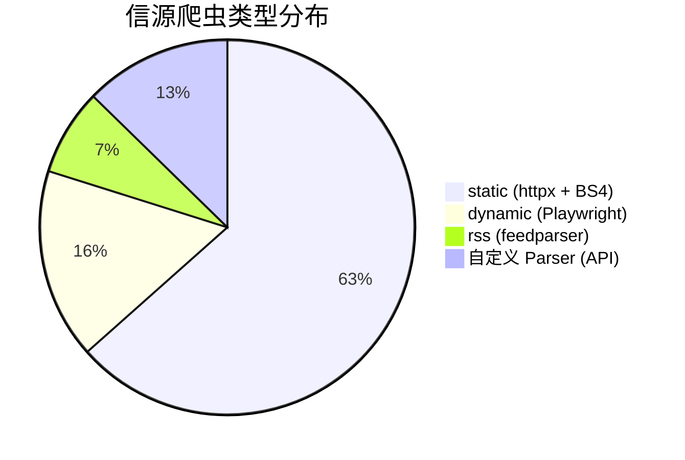
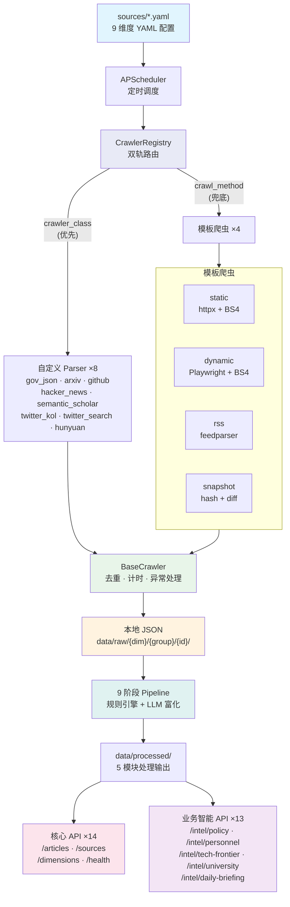
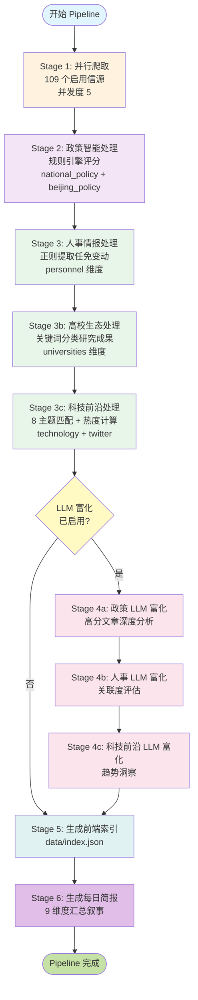

# Intelligence Engine Backend Services

中关村人工智能研究院**数据智能平台**（OpenClaw）。自动爬取多维信源（覆盖 **9 个信息维度 + 学者知识库**），通过 v1 REST API 向 **Dean-Agent、ScholarDB-System、Athena、NanoBot** 提供统一数据服务。维护 **2,200+ 位学者**档案，覆盖 9 所顶尖高校。接口与信源统计以自动生成文档为准（`docs/api/API_REFERENCE.md`）。

**技术栈**：FastAPI · APScheduler 3.x · httpx · BeautifulSoup4 · Playwright · feedparser · PostgreSQL（Supabase）+ 文件存储

---

```bash
# 一键部署（自动处理 venv、依赖、Playwright、启动）
./deploy.sh

# 或分步操作
./deploy.sh init         # 仅初始化
./deploy.sh start        # 启动服务
./deploy.sh stop         # 停止
./deploy.sh restart      # 重启
./deploy.sh status       # 查看详细状态
./deploy.sh logs -f      # 持续跟踪日志
```

---

## 快速开始（本地开发）

```bash
# 一键初始化 + 启动
./deploy.sh

# 或手动方式
python3 -m venv .venv && source .venv/bin/activate
pip install -e ".[dev]"
playwright install chromium
cp .env.example .env

# 前台启动（开发用）
uvicorn app.main:app --reload
# API 文档 → http://localhost:8000/docs
```

环境要求：Python 3.11+ · Node.js（Playwright 需要）

完整环境变量见 [.env.example](.env.example)。

---

## 全局论文仓

新增一套独立的 `papers` 全局论文主数据仓，用于统一沉淀多论文爬虫任务产生的论文客体数据，不直接替换现有 `student_publications` / `publications` / `publication_candidates` 业务链路。

README 只作为入口索引，详细信息分散到独立文档：

- 数据模型、去重、API、回填入口：[docs/paper_warehouse.md](docs/paper_warehouse.md)
- 顶刊顶会信源、爬虫方式、年份口径、字段覆盖率：[docs/paper_source_crawlers.md](docs/paper_source_crawlers.md)
- 字段补全方法与限流：[docs/paper-enrichment-source-method-matrix-20260503.md](docs/paper-enrichment-source-method-matrix-20260503.md)
- 作者画像补全状态：[docs/paper-author-enrichment-status-report-20260430.md](docs/paper-author-enrichment-status-report-20260430.md)

核心代码与配置：

- 信源配置：[sources/paper/top_conference_papers.yaml](sources/paper/top_conference_papers.yaml)
- 服务层：[app/services/paper_service.py](app/services/paper_service.py)
- API：[app/api/academic/papers.py](app/api/academic/papers.py)
- 回填脚本：[scripts/crawl/backfill_papers.py](scripts/crawl/backfill_papers.py)

---

## 🎨 前端 UI 控制台

**新增可视化爬虫管理界面**，支持信源选择、领域过滤、实时监控、多格式导出。

### 快速启动

```bash
# 方式 1：使用启动脚本（推荐）
./start_ui.sh

# 方式 2：手动启动
source venv/bin/activate
uvicorn app.main:app --host 0.0.0.0 --port 8001 --reload
```

### 访问地址

- **前端界面**：<http://localhost:8001/ui>
- **API 文档**：<http://localhost:8001/docs>

### 核心功能

1. **信源管理** - 按维度分组，支持批量选择，显示启用状态
2. **领域过滤** - 白名单/黑名单关键词过滤
3. **导出格式** - JSON/CSV/数据库三种格式
4. **实时监控** - 进度条、成功/失败统计、总条目数
5. **结果下载** - 自动生成下载链接，文件名含时间戳

技术栈：Vue 3 (CDN) + Axios + FastAPI

详细文档：[frontend/README.md](frontend/README.md)

---

## 问题定位指南

遇到问题时，按下表快速找到对应文件：

### 爬虫问题

| 现象 | 去哪里看 | 怎么测 |
|------|----------|--------|
| **某个信源**抓不到/选择器失效 | `sources/{维度}.yaml` → 该源的 `selectors` / `url` | `python scripts/run_single_crawl.py --source <id>` |
| **static 类型**整体不工作 | `app/crawlers/templates/static_crawler.py` | 同上，选一个 static 源测试 |
| **dynamic 类型**超时/白屏 | `app/crawlers/templates/dynamic_crawler.py` + YAML 中 `wait_for`/`wait_timeout` | 同上，选一个 dynamic 源测试 |
| **rss 类型**解析异常 | `app/crawlers/templates/rss_crawler.py` | 同上 |
| **snapshot 类型**没检测到变化 | `app/crawlers/templates/snapshot_crawler.py` | 同上 |
| **自定义 Parser** 出错（arxiv/github/twitter…） | `app/crawlers/parsers/{name}.py` | 同上 |
| 不知道源用哪个爬虫 | `app/crawlers/registry.py` 的路由映射 | — |

### 基础设施问题

| 现象 | 去哪里看 |
|------|----------|
| HTTP 请求失败 / 被封 / 限速 | `app/crawlers/utils/http_client.py`（重试、UA 轮换、限速） |
| Playwright 浏览器池异常 | `app/crawlers/utils/playwright_pool.py` |
| 文章重复 / 去重失效 | `app/crawlers/utils/dedup.py`（url_hash SHA-256） |
| JSON 文件没输出 | `app/crawlers/utils/json_storage.py` |
| 调度不执行 / 频率不对 | `app/scheduler/manager.py` + YAML 中 `schedule`/`is_enabled` |
| API 返回异常 | `app/api/` 各模块 |

### 调试脚本

| 脚本 | 用途 |
|------|------|
| `scripts/run_single_crawl.py --source <id>` | 隔离测试单个信源 |
| `scripts/run_all_crawl.py` | 批量运行所有启用信源 |
| `scripts/process_policy_intel.py --dry-run` | 政策智能预览 |
| `scripts/process_personnel_intel.py --dry-run` | 人事情报预览 |
| `scripts/process_tech_frontier.py --dry-run` | 科技前沿预览 |
| `scripts/process_university_eco.py --dry-run` | 高校生态预览 |
| `scripts/generate_index.py` | 生成 `data/index.json` 索引 |

---

## 消费端生态

OpenClaw 作为数据中台，向 4 个院内应用提供数据服务：

| 消费端 | 服务对象 | 核心数据集 |
|--------|---------|----------|
| **Dean-Agent** 情报引擎基座服务 | 院长办、院领导 | 政策情报 · 人事变动 · 科技前沿 · 每日简报 |
| **ScholarDB-System** 学者知识库 | 科研管理办 | 学者档案 · 项目库 · 机构图谱 · 导学关系 |
| **Athena** 战略情报引擎 | 战略发展部 | 全量文章检索 · 情报分析 · 舆情监测 |
| **NanoBot** 钉钉智能助理 | 全院各部门 | 全量 API（MCP 协议封装，自然语言访问） |

---

## 维度与信源

### 9 个信息监测维度

| 维度 ID | 名称 | 源数 | 启用 | YAML 文件 |
|---------|------|------|------|-----------|
| `national_policy` | 国家政策 | 8 | 6 | `sources/national_policy.yaml` |
| `beijing_policy` | 北京政策 | 14 | 10 | `sources/beijing_policy.yaml` |
| `technology` | 技术动态 | 34 | 33 | `sources/technology.yaml` |
| `talent` | 人才发展 | 7 | 4 | `sources/talent.yaml` |
| `industry` | 产业趋势 | 10 | 6 | `sources/industry.yaml` |
| `universities` | 高校动态 | 55 | 46 | `sources/universities-*.yaml` |
| `events` | 活动日程 | 6 | 4 | `sources/events.yaml` |
| `personnel` | 人事变动 | 4 | 4 | `sources/personnel.yaml` |
| `twitter` | 社交舆情 | 7 | 7 | `sources/twitter.yaml`† |

> † `sources/twitter.yaml` 的 7 个源按 `dimension` 字段跨维度分配：technology 4 源、industry 1 源、talent 1 源、sentiment 1 源。需配置 Twitter API key。

### 学者知识库维度

| 维度 | 名称 | 源数 | 覆盖高校 | YAML 文件 |
|------|------|------|---------|-----------|
| `scholars` | 高校师资 | 49 | 9 所（清华/北大/上交/中科院/浙大/南大/中科大/复旦/人大） | `sources/scholar-*.yaml` |

完整信源清单见 [`docs/SourceOverview.md`](docs/SourceOverview.md)。

### 爬虫类型分布


```mermaid
pie title 信源爬虫类型分布
    "static (httpx + BS4)" : 85
    "dynamic (Playwright)" : 22
    "rss (feedparser)" : 10
    "自定义 Parser (API)" : 17
```

### 配置 → 爬虫路由

YAML 中 `crawler_class`（优先）或 `crawl_method` 决定使用哪个爬虫：

```text
crawl_method: static   → app/crawlers/templates/static_crawler.py
crawl_method: dynamic  → app/crawlers/templates/dynamic_crawler.py
crawl_method: rss      → app/crawlers/templates/rss_crawler.py
crawl_method: snapshot → app/crawlers/templates/snapshot_crawler.py

crawler_class: gov_json_api      → app/crawlers/parsers/gov_json_api.py
crawler_class: arxiv_api         → app/crawlers/parsers/arxiv_api.py
crawler_class: github_api        → app/crawlers/parsers/github_api.py
crawler_class: hacker_news_api   → app/crawlers/parsers/hacker_news_api.py
crawler_class: semantic_scholar  → app/crawlers/parsers/semantic_scholar.py
crawler_class: twitter_kol       → app/crawlers/parsers/twitter_kol.py
crawler_class: twitter_search    → app/crawlers/parsers/twitter_search.py
crawler_class: hunyuan_api       → app/crawlers/parsers/hunyuan_api.py
```

路由逻辑在 `app/crawlers/registry.py`，详见 [架构文档](docs/architecture.md)。

---

## 系统架构

### 核心架构


```mermaid
graph TD
    YAML["sources/*.yaml<br/>9 维度 YAML 配置"] --> Scheduler["APScheduler<br/>定时调度"]
    Scheduler --> Registry["CrawlerRegistry<br/>双轨路由"]

    Registry -->|"crawler_class<br/>(优先)"| Custom["自定义 Parser ×8<br/>gov_json · arxiv · github<br/>hacker_news · semantic_scholar<br/>twitter_kol · twitter_search · hunyuan"]
    Registry -->|"crawl_method<br/>(兜底)"| Template["模板爬虫 ×4"]

    subgraph Templates["模板爬虫"]
        direction LR
        Static["static<br/>httpx + BS4"]
        Dynamic["dynamic<br/>Playwright + BS4"]
        RSS["rss<br/>feedparser"]
        Snapshot["snapshot<br/>hash + diff"]
    end

    Template --> Templates

    Custom --> Base["BaseCrawler<br/>去重 · 计时 · 异常处理"]
    Templates --> Base

    Base --> JSON["本地 JSON<br/>data/raw/{dim}/{group}/{id}/"]

    JSON --> Pipeline["9 阶段 Pipeline<br/>规则引擎 + LLM 富化"]
    Pipeline --> Processed["data/processed/<br/>5 模块处理输出"]

    Processed --> CoreAPI["核心 API ×14<br/>/articles · /sources<br/>/dimensions · /health"]
    Processed --> IntelAPI["业务智能 API ×13<br/>/intel/policy · /intel/personnel<br/>/intel/tech-frontier · /intel/university<br/>/intel/daily-briefing"]

    style YAML fill:#e1f5fe
    style Registry fill:#e8eaf6
    style Base fill:#e8f5e9
    style JSON fill:#fff3e0
    style Pipeline fill:#e0f2f1
    style CoreAPI fill:#fce4ec
    style IntelAPI fill:#f3e5f5
```

### 数据流

```
sources/*.yaml → APScheduler → CrawlerRegistry → 模板/自定义爬虫
                                                       ↓
                                                 爬取 + 解析
                                                       ↓
                                                 URL 去重 (SHA-256)
                                                       ↓
                                              JSON (data/raw/)
                                                       ↓
                                              9 阶段 Pipeline
                                                       ↓
                               ┌───────────────────────┴───────────────────────┐
                               ↓                                               ↓
                      核心 API (/api)                          业务智能 (/api/intel)
                      14 端点                                     13 端点（5 个模块）
```

### 项目结构

```text
app/
├── main.py                        # FastAPI 入口 + lifespan（启动 scheduler）
├── config.py                      # 配置
├── api/                        # REST API（27 个端点）
│   ├── articles.py                #   /articles CRUD + 搜索 + 统计
│   ├── sources.py                 #   /sources 管理 + 手动触发
│   ├── dimensions.py              #   /dimensions 9 维度概览
│   ├── health.py                  #   /health 健康检查
│   └── intel/                     #   业务智能子路由（5 个模块）
│       ├── router.py              #     聚合注册
│       ├── policy.py              #     政策智能
│       ├── personnel.py           #     人事情报
│       ├── tech_frontier.py       #     科技前沿
│       ├── university.py          #     高校生态
│       └── daily_briefing.py      #     每日简报
├── crawlers/
│   ├── base.py                    # BaseCrawler + CrawledItem + CrawlResult
│   ├── registry.py                # YAML → 爬虫实例路由（双轨：模板 + 自定义）
│   ├── templates/                 # 4 种模板爬虫
│   ├── parsers/                   # 8 个自定义 API Parser
│   └── utils/                     # 共享工具
├── scheduler/
│   ├── manager.py                 # 读取 YAML → 注册 APScheduler 任务
│   ├── jobs.py                    # 单次爬取执行
│   └── pipeline.py                # 9 阶段 Pipeline 编排
├── services/                      # 核心业务逻辑
│   ├── article_service.py
│   ├── source_service.py
│   ├── crawl_service.py
│   ├── dimension_service.py
│   ├── source_state.py            # 信源运行状态（JSON）
│   ├── crawl_log_store.py         # 爬取日志（JSON）
│   ├── json_reader.py             # 原始数据读取
│   └── intel/                     # 业务智能模块（5 个子包）
│       ├── shared.py              #   共享工具
│       ├── pipeline/              #   Pipeline 处理器
│       │   ├── base.py            #     HashTracker + save_output_json
│       │   ├── policy_processor.py
│       │   ├── personnel_processor.py
│       │   ├── tech_frontier_processor.py
│       │   ├── university_eco_processor.py
│       │   └── briefing_processor.py
│       ├── policy/                #   政策智能（rules + llm + service）
│       ├── personnel/             #   人事情报（rules + llm + service）
│       ├── tech_frontier/         #   科技前沿（rules + llm + service）
│       ├── university/            #   高校生态（rules + service）
│       └── daily_briefing/        #   每日简报（rules + llm + service）
└── schemas/                       # Pydantic v2 请求/响应
    └── intel/                     # 业务智能 schemas

sources/                           # YAML 配置（每维度一个文件）
scripts/                           # 运维脚本
data/
├── raw/                           # 爬取原始数据
├── processed/                     # 业务智能处理输出（5 个模块）
├── state/                         # 运行状态
├── logs/                          # 爬取日志
└── index.json                     # 前端索引
```

---

## API 参考

当前以自动生成文档为准：

- 汇总文档：`docs/api/API_REFERENCE.md`
- 路由清单（JSON）：`docs/api/api_inventory.json`
- 信源盘点（JSON）：`docs/api/source_inventory.json`

重新生成（代码变更后执行）：

```bash
./.venv/bin/python scripts/core/generate_api_docs.py
```

`/sources` 已升级为目录化查询能力：

- `GET /api/sources/catalog`：分页 + 分面 + 多维筛选（dimension/group/tag/health）
- `GET /api/sources/facets`：筛选分面值
- `GET /api/sources`：兼容旧接口，已支持更多筛选参数

---

## 信源配置

### 标准信源（零代码）

编辑 `sources/{dimension}.yaml` 添加条目：

```yaml
- id: "gov_cn_zhengce"              # 唯一 ID
  name: "中国政府网-最新政策"         # 显示名称
  group: "policy"                    # 分组（决定 JSON 输出子目录）
  url: "https://www.gov.cn/zhengce/"
  crawl_method: "static"             # static / dynamic / rss / snapshot
  schedule: "2h"                     # 2h / 4h / daily / weekly / monthly
  priority: 1
  is_enabled: true
  selectors:
    list_item: "ul.list li"          # 列表容器
    title: "a"                       # 标题
    link: "a"                        # 链接
    date: "span.date"               # 日期
    date_format: "%Y-%m-%d"
  base_url: "https://www.gov.cn"    # 补全相对链接
  tags: ["policy"]
  keyword_filter: ["人工智能"]       # 可选关键词过滤
```

dynamic 类型额外需要：
```yaml
  wait_for: "div.list li"           # Playwright 等待选择器
  wait_timeout: 15000               # 超时（ms）
```

### 自定义 Parser

1. `app/crawlers/parsers/` 新建类（继承 `BaseCrawler`）
2. `app/crawlers/registry.py` → `_CUSTOM_MAP` 注册
3. YAML 中 `crawler_class: "your_parser_name"`

---

## 数据输出

**混合存储（数据库 + 文件）**：

- 结构化业务数据（如文章、学者、机构、学生）以数据库为主存储。
- 爬取原始落盘、处理产物、运行状态与日志仍保留在 `data/` 目录。

**原始数据**：`data/raw/{dimension}/{group}/{source_id}/latest.json`（覆盖模式，每条标记 `is_new`）

```text
data/raw/
├── national_policy/policy/gov_cn_zhengce/latest.json
├── technology/academic/arxiv_cs_ai/latest.json
└── universities/ai_institutes/tsinghua_air/latest.json
```

**业务智能输出**：`data/processed/` 下按模块分目录

```text
data/processed/
├── policy_intel/          # 政策智能
│   ├── feed.json          #   政策动态（规则引擎 + LLM 评分）
│   └── opportunities.json #   政策机会
├── personnel_intel/       # 人事情报
│   ├── feed.json          #   人事动态
│   ├── changes.json       #   任免变动（正则提取）
│   └── enriched_feed.json #   LLM 富化版
├── tech_frontier/         # 科技前沿
│   ├── topics.json        #   8 大技术主题
│   ├── opportunities.json #   技术机会
│   └── stats.json         #   KPI 指标
├── university_eco/        # 高校生态
│   ├── overview.json      #   总览统计
│   ├── feed.json          #   高校动态
│   └── research_outputs.json # 研究成果
└── daily_briefing/        # 每日简报
    └── briefing.json      #   当日简报
```

**运行状态**：`data/state/source_state.json`（信源运行状态）、`data/logs/{source_id}/crawl_logs.json`（爬取日志）

---

## 每日 Pipeline

9 阶段自动处理，由 APScheduler 每日触发（支持并行爬取 + 实时进度条）：


```mermaid
graph TD
    Start([开始 Pipeline]) --> Stage1[Stage 1: 并行爬取<br/>109 个启用信源<br/>并发度 5]

    Stage1 --> Stage2[Stage 2: 政策智能处理<br/>规则引擎评分<br/>national_policy + beijing_policy]

    Stage2 --> Stage3[Stage 3: 人事情报处理<br/>正则提取任免变动<br/>personnel 维度]

    Stage3 --> Stage3b[Stage 3b: 高校生态处理<br/>关键词分类研究成果<br/>universities 维度]

    Stage3b --> Stage3c[Stage 3c: 科技前沿处理<br/>8 主题匹配 + 热度计算<br/>technology + twitter]

    Stage3c --> LLMCheck{LLM 富化<br/>已启用?}

    LLMCheck -->|是| Stage4a[Stage 4a: 政策 LLM 富化<br/>高分文章深度分析]
    Stage4a --> Stage4b[Stage 4b: 人事 LLM 富化<br/>关联度评估]
    Stage4b --> Stage4c[Stage 4c: 科技前沿 LLM 富化<br/>趋势洞察]

    LLMCheck -->|否| Stage5[Stage 5: 生成前端索引<br/>data/index.json]
    Stage4c --> Stage5

    Stage5 --> Stage6[Stage 6: 生成每日简报<br/>9 维度汇总叙事]

    Stage6 --> End([Pipeline 完成])

    style Start fill:#e1f5fe
    style Stage1 fill:#fff3e0
    style Stage2 fill:#f3e5f5
    style Stage3 fill:#e8f5e9
    style Stage3b fill:#e8f5e9
    style Stage3c fill:#e8f5e9
    style LLMCheck fill:#fff9c4
    style Stage4a fill:#fce4ec
    style Stage4b fill:#fce4ec
    style Stage4c fill:#fce4ec
    style Stage5 fill:#e0f2f1
    style Stage6 fill:#e1bee7
    style End fill:#c5e1a5
```

### Pipeline 阶段详情

| 阶段 | 名称 | 说明 | 耗时估算 |
| ---- | ---- | ---- | -------- |
| 1 | 并行爬取 | 109 个启用信源，并发度 5，实时进度条 | ~5-10 分钟 |
| 2 | 政策处理 | 规则引擎评分（national_policy + beijing_policy） | ~30 秒 |
| 3 | 人事处理 | 正则提取任免变动（personnel） | ~10 秒 |
| 3b | 高校生态 | 关键词分类研究成果（universities） | ~20 秒 |
| 3c | 科技前沿 | 8 主题匹配 + 热度计算（technology + twitter） | ~40 秒 |
| 4a-c | LLM 富化 | 政策 + 人事 + 科技前沿（条件触发） | ~2-5 分钟 |
| 5 | 索引生成 | 前端 data/index.json | ~5 秒 |
| 6 | 每日简报 | 9 维度汇总叙事 | ~30 秒 |

**LLM 富化阶段**由 `ENABLE_LLM_ENRICHMENT` + `OPENROUTER_API_KEY` 共同控制。

**手动触发 Pipeline**：

```bash
python scripts/run_all_crawl.py --concurrency 5  # 仅爬取阶段
# 完整 Pipeline 由 APScheduler 自动触发，或通过 API 手动触发
```

---

## 项目状态

**已完成**：

- 6 种模板爬虫 + 16 个自定义 Parser（含 LLM 自适应学者爬虫）
- 181 信源配置（138 启用），覆盖 9 个信息维度 + 学者知识库
- v1 API 全量端点与能力说明由 `docs/api/API_REFERENCE.md` 自动生成
- 9 阶段每日 Pipeline（爬取→处理→LLM→索引→简报）
- 5 个业务智能模块：政策智能 · 人事情报 · 科技前沿 · 高校生态 · 每日简报
- 学者知识库：**2,200+ 位学者**档案，覆盖清华/北大/上交/中科院等 9 所高校
- 4 个消费端：Dean-Agent · ScholarDB-System · Athena · NanoBot
- 数据库 + 文件混合存储；前后端已部署至线上服务器

**待完成**：sentiment 维度扩展 · 部分禁用高校源修复 · 测试覆盖

详见 `docs/TODO.md`。

---

## 项目文档

| 文档 | 路径 | 内容 |
|------|------|------|
| API 总览（自动生成） | `docs/api/API_REFERENCE.md` | 全量路由、服务分组、信源维度覆盖、Agent 调用映射 |
| API 路由清单（JSON） | `docs/api/api_inventory.json` | 机器可读路由盘点（供 Agent/脚本使用） |
| 信源盘点（JSON） | `docs/api/source_inventory.json` | 机器可读信源统计（维度/分组/标签） |
| 平台架构 | `docs/architecture.md` | 5 层平台架构、消费端接入、设计决策 |
| 信源全景 | `docs/SourceOverview.md` | 181 个信源全量清单，按维度/类型/状态 |
| 产品生态 | `docs/files/产品生态架构全景.md` | 领导汇报用，平台定位 + 价值地图 + 演进方向 |
| 爬取状态 | `docs/CrawlStatus.md` | 各维度各源的爬取状态、数据量 |
| 任务优先级 | `docs/TODO.md` | P0-P3 分级待办 |
| 院长需求 | `docs/files/情报引擎基座服务.md` | 前端 Dean-Agent 功能需求 |
| Agent Skill（OpenClaw 拉数） | `fetch-data/SKILL.md` | fetch-data 技能：接口路由、参数映射、一次性执行（不落盘脚本） |
