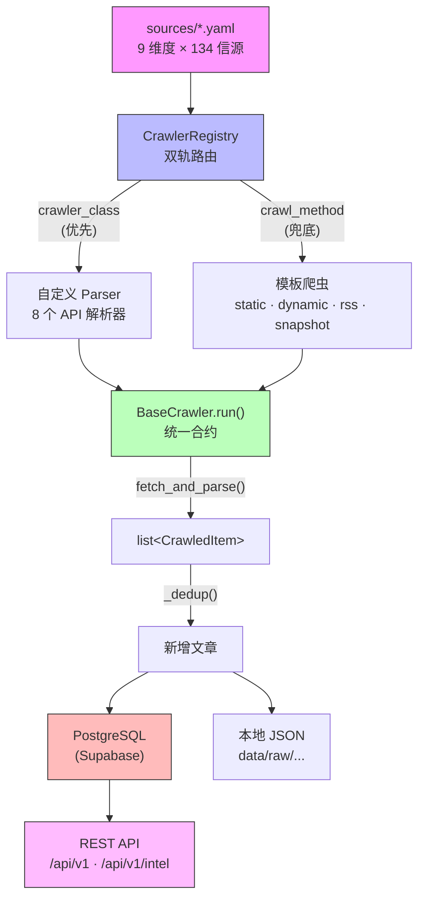
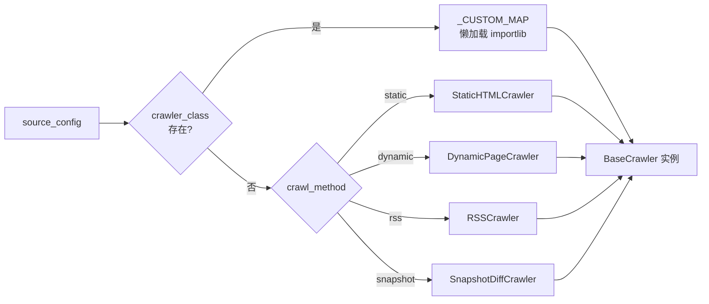
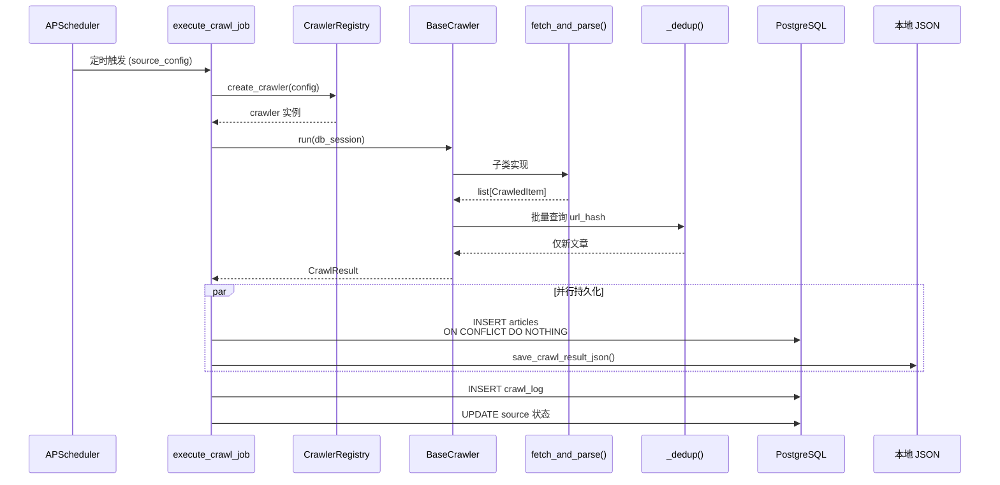

# 爬虫框架架构设计文档

> 最后更新: 2026-02-24

中关村人工智能研究院信息监测系统——爬虫框架核心架构与数据流说明。

---

## 一、设计理念

**"YAML 配置驱动 + 模板/自定义双轨路由"**——用最少的代码覆盖最多的信源。

核心原则：
- **配置驱动**：YAML 声明式描述信源，新增标准信源零代码
- **模板复用**：4 个模板爬虫覆盖绝大多数网站结构，共享解析逻辑
- **合约分离**：BaseCrawler 把"拿数据"和"存数据/去重/调度"完全隔离

---

## 二、分层架构总览



---

## 三、三层抽象

### 第一层：BaseCrawler 合约

**文件**：`app/crawlers/base.py`

所有爬虫只需实现一个方法：

```python
class BaseCrawler(ABC):
    def __init__(self, source_config: dict) -> None
    async def run(db_session) -> CrawlResult       # 主入口（基类实现）
    async def fetch_and_parse() -> list[CrawledItem] # 子类必须实现
    async def _dedup(items, db_session) -> list[CrawledItem]  # 基类去重
```

基类 `run()` 统一处理：
- 计时与异常捕获
- 状态枚举：`SUCCESS` / `NO_NEW_CONTENT` / `PARTIAL` / `FAILED`
- 基于 `url_hash` 的数据库去重
- 返回标准化 `CrawlResult`

**效果**：任何新爬虫只关心"怎么拿数据"，不关心去重、存储、日志。

### 第二层：4 个模板爬虫（覆盖 ~80% 信源）

**目录**：`app/crawlers/templates/`

| 模板 | 文件 | 适用场景 | 核心能力 |
|------|------|---------|---------|
| **static** | `static_crawler.py` | 服务端渲染 HTML 列表页 | httpx + BeautifulSoup + CSS 选择器 |
| **dynamic** | `dynamic_crawler.py` | JS 渲染的页面 | Playwright 渲染 + 等待条件 + CSS 选择器 |
| **rss** | `rss_crawler.py` | RSS/Atom 订阅源 | feedparser 解析 |
| **snapshot** | `snapshot_crawler.py` | 无列表结构、监测页面变化 | 整页哈希对比 + diff 生成 |

**关键设计**：static 和 dynamic 共享 `selector_parser.py` 中的 `parse_list_items()` + `parse_detail_html()`，区别仅在获取 HTML 的方式（httpx vs Playwright），消除 ~100 行重复代码。

### 第三层：自定义 Parser（处理特殊协议）

**目录**：`app/crawlers/parsers/`

对于有结构化 API 的信源，继承 `BaseCrawler` 写专用解析逻辑：

| Parser | 文件 | 协议/格式 |
|--------|------|----------|
| `gov_json_api` | `gov_json_api.py` | 国务院 JSON 搜索接口 |
| `arxiv_api` | `arxiv_api.py` | ArXiv Atom API |
| `github_api` | `github_api.py` | GitHub REST API |
| `hacker_news_api` | `hacker_news_api.py` | HN Firebase API |
| `semantic_scholar` | `semantic_scholar.py` | Semantic Scholar API |
| `twitter_kol` | `twitter_kol.py` | Twitter KOL 监控 |
| `twitter_search` | `twitter_search.py` | Twitter 关键词搜索 |
| `hunyuan_api` | `hunyuan_api.py` | 腾讯混元 API |

---

## 四、Registry 双轨路由

**文件**：`app/crawlers/registry.py`



```python
class CrawlerRegistry:
    @staticmethod
    def create_crawler(source_config) -> BaseCrawler:
        # 优先级 1：crawler_class → 自定义 Parser
        if crawler_class := source_config.get("crawler_class"):
            return _CUSTOM_MAP[crawler_class](source_config)

        # 优先级 2：crawl_method → 模板爬虫
        method = source_config.get("crawl_method")
        return _TEMPLATE_MAP[method](source_config)
```

- **`_CUSTOM_MAP`**：`crawler_class` 字符串 → Parser 类的点路径
- **`_TEMPLATE_MAP`**：`crawl_method` 字符串 → 模板爬虫类的点路径
- **懒加载**：`importlib.import_module()` 动态导入，避免启动时加载所有类

---

## 五、YAML 配置体系

**目录**：`sources/`，每个维度一个 YAML 文件。

### 配置字段全集

```yaml
dimension: "technology"          # 语义维度
sources:
  - id: "source_unique_id"       # 全局唯一 ID
    name: "显示名称"
    group: "分组"                 # 组织归属
    url: "https://..."            # 目标 URL

    # ── 爬虫选择（二选一）──
    crawl_method: "static"        # static | dynamic | rss | snapshot
    crawler_class: "arxiv_api"    # 自定义 Parser（优先级更高）

    # ── 调度 ──
    schedule: "4h"                # 2h | 4h | daily | weekly | monthly
    is_enabled: true
    priority: 1                   # 1-5，预留

    # ── 列表页选择器（模板爬虫用）──
    selectors:
      list_item: "ul.list li"     # 每条文章的 CSS 选择器
      title: "a"                  # 标题（"_self" = 元素本身）
      link: "a"                   # 链接
      link_attr: "href"           # 链接属性，默认 href
      date: "span.date"           # 日期
      date_format: "%Y-%m-%d"     # strptime 格式
      date_regex: "(\\d{4}-\\d{2}-\\d{2})"  # 可选正则提取

    # ── 详情页选择器（可选）──
    detail_selectors:
      content: "div.article-body"
      author: "span.author"

    # ── Dynamic 专用 ──
    wait_for: "networkidle"       # 等待条件：networkidle | CSS 选择器
    wait_timeout: 15000           # 毫秒
    detail_use_playwright: false  # 详情页用 Playwright 还是 httpx

    # ── 自定义 Parser 专用 ──
    search_query: "cat:cs.AI"     # ArXiv
    max_results: 20
    search_keywords: ["AI"]       # Gov API

    # ── 通用选项 ──
    keyword_filter: ["AI", "大模型"]  # 关键词过滤
    base_url: "https://..."       # 相对链接基地址
    headers: {}                   # 自定义请求头
    encoding: "utf-8"             # 编码覆盖
    request_delay: 2.0            # 请求间隔（秒）
    tags: ["tech_media"]          # 文章标签
```

### 各类型信源配置示例

**静态 HTML（政府网站）**：
```yaml
- id: "ndrc_policy"
  url: "https://www.ndrc.gov.cn/xxgk/zcfb/tz/"
  crawl_method: "static"
  selectors:
    list_item: "ul.u-list li"
    title: "a"
    link: "a"
    date: "span"
    date_format: "%Y/%m/%d"
  detail_selectors:
    content: "div.TRS_Editor"
```

**动态 JS 页面**：
```yaml
- id: "gov_cn_zhengce"
  url: "https://www.gov.cn/zhengce/zuixin/"
  crawl_method: "dynamic"
  wait_for: "div.list_2 li"
  wait_timeout: 15000
  selectors:
    list_item: "div.list_2 li"
    title: "h4 a"
    link: "h4 a"
    date: "span.date"
  detail_selectors:
    content: "div.pages_content"
  detail_use_playwright: false
```

**RSS 订阅**：
```yaml
- id: "techcrunch_ai_rss"
  url: "https://techcrunch.com/category/artificial-intelligence/feed/"
  crawl_method: "rss"
  max_entries: 15
```

**自定义 API Parser**：
```yaml
- id: "arxiv_ai"
  crawler_class: "arxiv_api"
  search_query: "cat:cs.AI"
  max_results: 20
  sort_by: "submittedDate"
```

**页面快照监测**：
```yaml
- id: "leadership_roster"
  url: "https://example.com/team/"
  crawl_method: "snapshot"
  selectors:
    content_area: "div.roster"
  ignore_patterns:
    - "\\d{4}-\\d{2}-\\d{2}"
```

---

## 六、共享解析层：selector_parser

**文件**：`app/crawlers/utils/selector_parser.py`

static 和 dynamic 模板共用的列表/详情解析引擎。

### 列表页解析

```python
def parse_list_items(soup, selectors, base_url, keyword_filter) -> list[RawListItem]:
    """
    1. CSS 选择器匹配所有 list_item 元素
    2. 逐条提取 title / link / date
    3. 应用 keyword_filter 过滤
    4. 按 title 去重（部分站点跨路径重复）
    """
```

### 日期提取三策略（逐级降级）

1. **CSS 选择器 + strptime**：`date` 选择器 + `date_format`，可选 `date_regex`
2. **URL 路径模式**：`/t20250701_xxx.html` → `2025-07-01`
3. **URL 目录模式**：`/202507/txxx.html` → `2025-07-01`

### 详情页解析

```python
def parse_detail_html(html, detail_selectors, page_url, config) -> DetailResult:
    """
    提取：content HTML（经 bleach 清洗）、纯文本、content_hash、
          author、images、pdf_url
    """
```

### 特殊约定

- **`_self`**：`title: "_self"` 表示 `list_item` 元素本身即为标题（常见于 `<a>` 即列表项的页面）

---

## 七、HTTP 客户端与防护机制

**文件**：`app/crawlers/utils/http_client.py`

| 机制 | 说明 |
|------|------|
| **User-Agent 轮换** | 5 种 UA 随机选取 |
| **域名级限速** | 每个域名一个 asyncio Semaphore + 最小请求间隔 |
| **指数退避重试** | `2^attempt + random jitter`，可配 `max_retries` |
| **请求延迟** | YAML `request_delay` 控制，或使用全局默认值 |

---

## 八、去重机制

**文件**：`app/crawlers/utils/dedup.py`

### 两层去重

| 层 | 函数 | 用途 |
|----|------|------|
| URL 归一化 | `normalize_url()` | 小写化、剥离追踪参数（utm_*、spm 等）、去尾 slash |
| URL 哈希 | `compute_url_hash()` | SHA-256，用作 DB UNIQUE 约束 |
| 内容哈希 | `compute_content_hash()` | SHA-256（折叠空白），检测近似重复 |

### BaseCrawler._dedup() 流程

```
计算所有 item 的 url_hash
    → 批量查询 DB 中已有的 hash 集合
    → 过滤出仅新 item
```

### Snapshot 特殊处理

URL 拼接 fragment：`{url}#snapshot-{content_hash[:12]}`，使同一 URL 的不同变更各自通过去重。

---

## 九、数据流全链路



```
┌──────────────────────────────────────────────────────────────┐
│ 1. 启动：Scheduler Manager (app/scheduler/manager.py)         │
│    - 加载 sources/*.yaml 所有配置                              │
│    - 自动 seed 信源到 DB（避免 FK violation）                   │
│    - 按 schedule 注册 APScheduler 任务（带 jitter 防惊群）      │
└──────────────────────┬───────────────────────────────────────┘
                       │ APScheduler 定时触发
                       ▼
┌──────────────────────────────────────────────────────────────┐
│ 2. 任务入口：execute_crawl_job (app/scheduler/jobs.py)        │
│    source_config 从 YAML 原样传入                              │
└──────────────────────┬───────────────────────────────────────┘
                       │
                       ▼
┌──────────────────────────────────────────────────────────────┐
│ 3. 路由：CrawlerRegistry.create_crawler()                     │
│    crawler_class → 自定义 Parser（优先）                       │
│    crawl_method  → 模板爬虫（兜底）                            │
│    懒加载：importlib.import_module()                          │
└──────────────────────┬───────────────────────────────────────┘
                       │
                       ▼
┌──────────────────────────────────────────────────────────────┐
│ 4. 执行：BaseCrawler.run(db_session)                          │
│    a. fetch_and_parse() → list[CrawledItem]                   │
│    b. _dedup() → 过滤已存在的 url_hash                        │
│    c. 异常捕获 → CrawlResult(status=FAILED)                   │
└──────────────────────┬───────────────────────────────────────┘
                       │
          ┌────────────┼────────────┐
          ▼            ▼            ▼
   ┌────────────┐ ┌─────────┐ ┌──────────┐
   │ 模板爬虫    │ │ 自定义   │ │ Snapshot │
   │            │ │ Parser  │ │ 对比     │
   │ static:    │ │         │ │          │
   │  httpx     │ │ API 请求 │ │ 整页哈希  │
   │  +BS4      │ │ JSON/XML│ │ diff 生成 │
   │  +选择器    │ │ 解析    │ │          │
   │            │ │         │ │          │
   │ dynamic:   │ │         │ │          │
   │  Playwright│ │         │ │          │
   │  +BS4      │ │         │ │          │
   │  +选择器    │ │         │ │          │
   │            │ │         │ │          │
   │ rss:       │ │         │ │          │
   │  feedparser│ │         │ │          │
   └─────┬──────┘ └────┬────┘ └─────┬────┘
         └──────────────┼───────────┘
                        ▼
┌──────────────────────────────────────────────────────────────┐
│ 5. 持久化 (execute_crawl_job)                                 │
│                                                              │
│   5a. DB 写入                      5b. 本地 JSON              │
│   ┌─────────────────────────┐     ┌────────────────────────┐ │
│   │ INSERT articles          │     │ save_crawl_result_json │ │
│   │ ON CONFLICT DO NOTHING   │     │ → data/raw/{dim}/     │ │
│   │ (url_hash UNIQUE)        │     │   {group}/{id}/       │ │
│   │                          │     │   latest.json         │ │
│   │ 合并 tags（源配置+文章） │     │                        │ │
│   │ extra 存自定义字段       │     │ 标记 is_new（对比上次）│ │
│   └─────────────────────────┘     └────────────────────────┘ │
│                                                              │
│   5c. 写 CrawlLog             5d. 更新 Source 状态            │
│   ┌─────────────────────────┐ ┌────────────────────────────┐ │
│   │ status, items_total,     │ │ last_crawl_at              │ │
│   │ items_new, error_message,│ │ last_success_at            │ │
│   │ duration_seconds         │ │ consecutive_failures       │ │
│   └─────────────────────────┘ └────────────────────────────┘ │
└──────────────────────────────────────────────────────────────┘
```

---

## 十、调度机制

**文件**：`app/scheduler/manager.py`

### Schedule 映射

| YAML 值 | APScheduler Trigger |
|---------|---------------------|
| `"2h"` | `IntervalTrigger(hours=2)` |
| `"4h"` | `IntervalTrigger(hours=4)` |
| `"daily"` | `CronTrigger(hour=6, minute=0)` |
| `"weekly"` | `CronTrigger(day_of_week="mon", hour=3)` |
| `"monthly"` | `CronTrigger(day=1, hour=2)` |

每个任务注册时加 `jitter=random(0, 300)` 秒，防止所有任务同时触发（惊群效应）。

---

## 十一、防护性设计

| 机制 | 位置 | 解决的问题 |
|------|------|-----------|
| URL 归一化去重 | `dedup.py` | 剥离追踪参数后哈希，避免同一文章因 URL 参数不同而重复入库 |
| `ON CONFLICT DO NOTHING` | `jobs.py` | 防止 url_hash 冲突导致整个事务回滚 |
| 域名级限速 + UA 轮换 | `http_client.py` | 避免被目标站点封禁 |
| Snapshot fragment URL | `snapshot_crawler.py` | `#snapshot-{hash}` 让同 URL 不同快照各自通过去重 |
| 创建失败也记日志 | `jobs.py` | 即使 crawler 实例化异常也有 CrawlLog 可追溯 |
| Playwright 浏览器池 | `playwright_pool.py` | 复用浏览器实例，控制并发数 |
| 详情页降级 | `dynamic_crawler.py` | `detail_use_playwright: false` 时用 httpx 抓详情页，更快更稳 |

---

## 十二、数据模型

### Article 表（核心）

| 字段 | 类型 | 说明 |
|------|------|------|
| `url_hash` | `String(64) UNIQUE` | 去重主键 |
| `url` | `Text` | 完整 URL |
| `title` | `Text` | 标题 |
| `content` | `Text` | 纯文本正文 |
| `content_html` | `Text` | 清洗后的 HTML 正文 |
| `content_hash` | `String(64)` | 内容哈希（近似去重） |
| `published_at` | `DateTime` | 发布时间 |
| `crawled_at` | `DateTime` | 爬取时间 |
| `author` | `String` | 作者 |
| `tags` | `ARRAY(String)` | 标签（源配置 + 文章级） |
| `extra` | `JSONB` | 自定义字段（pdf_url, images, categories 等） |

### 关联表

- **Source**：信源元数据 + 运行状态（last_crawl_at, consecutive_failures）
- **CrawlLog**：每次爬取的执行记录
- **Snapshot**：snapshot_crawler 的历史快照

---

## 十三、目录结构

```
app/
├── crawlers/
│   ├── base.py                    # BaseCrawler 抽象基类
│   ├── registry.py                # 双轨路由（模板 + 自定义）
│   ├── templates/                 # 4 个模板爬虫
│   │   ├── static_crawler.py
│   │   ├── dynamic_crawler.py
│   │   ├── rss_crawler.py
│   │   └── snapshot_crawler.py
│   ├── parsers/                   # 8 个自定义 Parser
│   │   ├── gov_json_api.py
│   │   ├── arxiv_api.py
│   │   ├── github_api.py
│   │   ├── hacker_news_api.py
│   │   ├── semantic_scholar.py
│   │   ├── twitter_kol.py
│   │   ├── twitter_search.py
│   │   └── hunyuan_api.py
│   └── utils/                     # 共享工具
│       ├── selector_parser.py     # 列表/详情页解析引擎
│       ├── http_client.py         # HTTP 客户端（重试/限速/UA）
│       ├── dedup.py               # URL 归一化 + 哈希去重
│       ├── json_storage.py        # 本地 JSON 存储
│       ├── playwright_pool.py     # 浏览器实例池
│       ├── html_sanitizer.py      # HTML 清洗
│       └── image_extractor.py     # 图片提取
├── scheduler/
│   ├── manager.py                 # 任务注册与调度管理
│   └── jobs.py                    # 单次执行逻辑 + DB 持久化
├── models/                        # SQLAlchemy 模型
│   ├── article.py
│   ├── source.py
│   ├── crawl_log.py
│   └── snapshot.py
└── ...

sources/                           # YAML 配置（每维度一个文件）
├── national_policy.yaml
├── beijing_policy.yaml
├── technology.yaml
├── talent.yaml
├── industry.yaml
├── universities.yaml
├── events.yaml
├── personnel.yaml
└── twitter.yaml

data/raw/{dimension}/{group}/{source_id}/   # 本地 JSON 输出
└── latest.json
```

---

## 十四、扩展指南

### 新增标准信源（零代码）

编辑 `sources/{dimension}.yaml`，添加条目，配置 `crawl_method` + `selectors` 即可。

### 新增自定义 Parser

1. `app/crawlers/parsers/{name}.py` 继承 `BaseCrawler`，实现 `fetch_and_parse()`
2. `app/crawlers/registry.py` 的 `_CUSTOM_MAP` 添加映射
3. `sources/*.yaml` 中配置 `crawler_class: "{name}"`

### 新增模板爬虫

1. `app/crawlers/templates/{type}_crawler.py` 继承 `BaseCrawler`
2. `app/crawlers/registry.py` 的 `_TEMPLATE_MAP` 添加映射
3. YAML 中通过 `crawl_method: "{type}"` 引用
