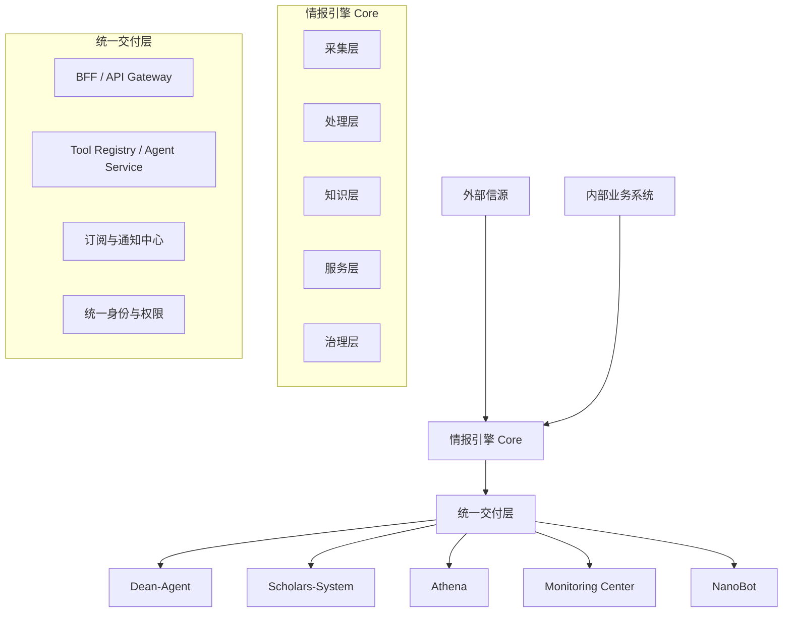

# 平台分层架构与能力边界

> 面向架构设计、技术规划和平台治理的工作文档  
> 更新日期：2026-03-31  
> 关联总纲：[情报引擎产品战略与演进路线图](./情报引擎产品战略与演进路线图.md)

---

## 1. 文档目标

这份文档解决两个问题：

1. 平台到底应该分成哪些层
2. 哪些能力必须下沉到底座，哪些能力只属于某个前台

---

## 2. 目标架构总图



---

## 3. 五层能力模型

## 3.1 采集层 Ingestion

### 目标

持续获取外部和内部信号。

### 当前已有能力

- YAML 配置信源
- 多类爬虫模板
- 自定义 parser
- 定时调度
- 增量拉取与去重

### 未来应承载的能力

- 统一接入规范
- 接入状态监控
- 失败重试与恢复
- 数据源质量评分
- 内部系统连接器
- 手动补采与回放

### 边界

采集层只负责“把数据拿回来”，不负责最终业务结论。

---

## 3.2 处理层 Processing

### 目标

把原始数据处理成可消费、可判断、可行动的情报对象。

### 当前已有能力

- 政策、人事、科技、高校、简报等 pipeline
- 规则引擎
- LLM 富化
- 标签、排序、主题聚合

### 未来应承载的能力

- 实体抽取与归一
- 跨源合并
- 语义去重
- 置信度评分
- 机会识别
- 风险识别
- 任务建议生成

### 边界

处理层输出的是标准化中间结果或服务结果，不应直接耦合某个前台的展示字段。

---

## 3.3 知识层 Knowledge

### 目标

沉淀可长期复用的知识资产。

### 核心对象

- 文章
- 政策
- 人物
- 学者
- 机构
- 项目
- 活动
- 事件
- 关系
- 证据
- 监测目标
- 任务

### 未来应承载的能力

- 统一实体 ID
- 统一关系模型
- 快照与版本
- 证据链存储
- 人工校准回写
- 来源与更新时间管理

### 边界

知识层负责长期资产沉淀，不应混入仅用于一次性展示的临时拼接对象。

---

## 3.4 服务层 Service

### 目标

以稳定契约向 GUI 和 Agent 暴露能力。

### 应包含的能力

- 资源型 API
- 分析型 API
- 聚合型 API
- Tool API
- 任务触发接口
- 订阅管理接口

### 必须新增的两个子层

#### 1. BFF / API Gateway

职责：

- 面向不同前台聚合字段
- 屏蔽底层结构调整
- 进行角色化裁剪

#### 2. Tool Registry / Agent Service

职责：

- 统一定义 Agent 可调用工具
- 管理输入输出 Schema
- 管理权限和审计

### 边界

服务层应暴露稳定契约，不应让前台直接依赖底层文件结构或内部处理细节。

---

## 3.5 治理层 Governance

### 目标

让平台可治理、可审计、可扩展。

### 必须补齐的能力

- 身份与权限
- 操作审计
- 数据血缘
- 指标口径统一
- 数据质量监控
- 任务与告警可追踪

### 当前最紧迫的问题

平台对信源数、API 数、能力覆盖范围已经存在口径不一致，说明治理层不能再视为“以后再补”的工作。

### 边界

治理层不是附属功能，而是平台化的前提条件。

---

## 4. 统一交付层

这层是当前架构里最缺失、但未来最关键的一层。

## 4.1 为什么必须有统一交付层

如果没有这层：

- GUI 会直接耦合底层 API
- Agent 会绕过契约私自拼 API
- 每个产品都会自己做通知、订阅、权限
- 平台底层一旦重构，上层全面受影响

## 4.2 统一交付层组成

| 子层 | 职责 |
|---|---|
| `Portal` | 统一入口、搜索、通知、任务 |
| `BFF / API Gateway` | 前台聚合与裁剪 |
| `Tool Registry` | Agent 工具统一管理 |
| `Subscription Center` | 订阅、推送、广播 |
| `Identity Layer` | 用户、角色、权限映射 |

---

## 5. 各前台与底座的边界

## 5.1 `Dean-Agent`

### 负责

- 展示结论
- 高优先级提醒
- 领导视角的聚合判断

### 不负责

- 大量基础数据维护
- 复杂审批和台账管理
- 多层级分类体系维护

## 5.2 `Scholars-System`

### 负责

- 结构化知识录入和维护
- 审核、纠错、校准
- 学者、机构、项目、活动运营

### 不负责

- 领导态势驾驶舱
- 即时问答入口

## 5.3 `Athena`

### 负责

- 深度检索
- 多维分析
- 专题研究

### 不负责

- 结构化基础台账维护
- 订阅触达入口

## 5.4 `Monitoring Center`

### 负责

- 目标监测
- 规则配置
- 告警闭环
- 证据回查

### 不负责

- 泛化情报首页
- 复杂基础知识运营

## 5.5 `NanoBot`

### 负责

- 自然语言访问
- 工具调用
- 消息推送
- 任务拉起

### 不负责

- 承担所有复杂 GUI 功能
- 绕开平台治理直接写入所有系统

---

## 6. 数据对象边界

## 6.1 建议统一对象分层

```text
Raw Object
  -> 采集结果

Normalized Object
  -> 清洗与字段归一

Knowledge Object
  -> 长期知识资产

Intel Object
  -> 面向情报消费的结果对象

Task / Alert Object
  -> 面向行动和闭环的对象
```

## 6.2 为什么要分层

如果不分层：

- 前台会直接消费采集字段
- LLM 结果难以追踪
- 人工修正无法回写到正确层级
- 同一个对象在不同系统有多套定义

---

## 7. `academic-monitor` 的落位方式

建议将其能力拆解后融入 Core：

| `academic-monitor` 当前能力 | 未来落位 |
|---|---|
| `MonitoringTarget` 抽象 | Core 知识层 / 监测域 |
| 目标源配置 | 监测配置中心 |
| discovery strategy | 处理层 / 监测策略 |
| assessment engine | 处理层 / 规则引擎 |
| notification system | 统一订阅与通知中心 |
| scheduler | Core 调度层 |
| storage | Core 知识层 / 平台存储层 |

结论：

保留抽象与机制，不保留平行平台。

---

## 8. 平台能力归属规则

任何能力在设计时，都先判断归属：

### 8.1 必须进 Core 的能力

- 可被多个产品复用
- 与数据质量和口径有关
- 与权限和审计有关
- 与监测、通知、任务有关

### 8.2 可以留在前台的能力

- 纯展示层交互
- 特定角色页面布局
- 场景专属 UI 细节

### 8.3 必须避免的反模式

- 前台自己定义底层对象
- Agent 自己维护隐式 API 契约
- 每个产品自己做一套订阅与通知
- 每个产品自己做身份和权限

---

## 9. 推荐技术演进方向

### 9.1 存储层

从当前偏文件式实现，逐步演进为：

- 结构化数据存储
- 检索与搜索索引
- 对象内容存储
- 快照与版本管理

### 9.2 服务层

从单纯 REST API，逐步演进为：

- REST API
- 聚合 API / BFF
- Tool API
- 订阅与任务 API

### 9.3 处理层

从规则 + 局部 LLM 富化，逐步演进为：

- 规则引擎
- 语义抽取
- 实体归一
- 语义去重
- 任务建议与行动编排

---

## 10. 一句话总结

平台下一阶段最重要的事，不是再增加一个前台，而是：

**把采集、处理、知识、服务、治理五层真正拉开，并通过统一交付层向 GUI 与 Agent 稳定分发。**
