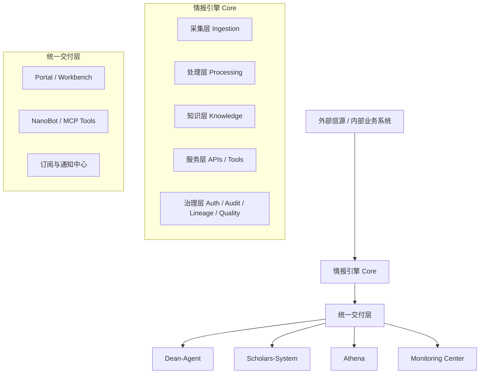

# 院内情报引擎产品战略与演进路线图

> 基于 `workspace` 下现有 5 个项目的现状梳理形成的统一战略文档  
> 更新日期：2026-03-31  
> 适用范围：`DeanAgent-Backend`、`Dean-Agent-Fronted`、`Scholars-System`、`academic-monitor`、`Dean-NanoBot`
>
> 延伸文档：
> - [产品矩阵与角色工作台设计](./产品矩阵与角色工作台设计.md)
> - [平台分层架构与能力边界](./平台分层架构与能力边界.md)
> - [各项目演进路线与职责划分](./各项目演进路线与职责划分.md)
> - [项目整合与重命名方案](./项目整合与重命名方案.md)

---

## 1. 这份文档要解决什么问题

当前 `workspace` 下的项目并不是几个完全独立的产品，而是同一套能力在不同服务对象、不同交互场景下的不同交付形态。随着版本演进，现状已经出现 4 个典型问题：

1. **按部门需求切产品，导致能力重复建设**
2. **GUI 与 Agent 的边界不清，产品定义权摇摆**
3. **底层已经形成“平台”，上层仍按“定制系统”推进**
4. **文档口径与能力边界开始发散，后续难以持续迭代**

这份文档的目标不是替代各项目现有 README 或技术架构文档，而是给整个情报引擎体系提供统一的：

- 产品定位
- 能力分层
- 产品矩阵
- GUI / Agent 分工
- 各项目未来迭代方向
- 12 到 15 个月演进路线

---

## 2. 现状判断

### 2.1 现有项目的真实角色

| 项目 | 当前形态 | 实际角色 | 主要服务对象 |
|---|---|---|---|
| `DeanAgent-Backend` | 爬虫 + API + Pipeline + 学者/机构服务 | 情报底座 / 数据中台雏形 | 所有上层产品 |
| `Dean-Agent-Fronted` | 院长端前台 | 领导决策驾驶舱 | 院长办、院领导 |
| `Scholars-System` | 学者/机构/项目/活动前台 | 知识运营台 | 科研管理、情报运营 |
| `academic-monitor` | 泛化监测框架 | 目标监测引擎 | 学术监测、审计、告警 |
| `Dean-NanoBot` | IM/Agent 助手框架 | 统一自然语言入口 / 触达层 | 全院各部门 |

### 2.2 已经出现的平台化信号

从代码和文档看，当前体系已经具备平台雏形：

- 统一采集层：多类信源、多类爬虫、多维度调度
- 统一处理层：政策、人事、科技、高校、简报等情报加工链路
- 统一服务层：REST API 已经覆盖文章、学者、机构、项目、活动、情报等多个域
- 多终端消费：领导前台、知识库前台、监测系统、Agent 入口都在消费同一底座

因此，下一阶段不应再把这些项目视为“几个分散系统”，而应明确它们是：

**一个情报底座 + 两种交互方式 + 多个角色工作台**

### 2.3 当前最关键的结构性问题

#### 问题 1：产品是按需求长出来的，不是按能力设计出来的

这会导致：

- 同一份数据能力在多个项目重复封装
- 同一个需求被 GUI 和 Agent 各做一遍
- 一个前台不断吞并更多并不属于自身核心价值的模块

#### 问题 2：领导驾驶舱与运营系统边界混淆

`Dean-Agent-Fronted` 中已经包含大量“院内管理”“学生管理”“项目督办”“CRM/关系维护”“日程协同”类诉求，但其中很多并不属于情报引擎本身，而是需要对接内部业务系统的运营能力。

如果不收口，`Dean-Agent` 会逐渐从“情报决策驾驶舱”滑向“万能领导门户”，最终失去产品焦点。

#### 问题 3：监测能力开始重复生长

`academic-monitor` 的抽象已经覆盖：

- target-centric 目标配置
- 多源发现
- 评估规则
- 调度
- 存储
- 通知

这些能力与 `DeanAgent-Backend` 的部分 pipeline / processing / scheduling / storage 已明显同构。继续独立推进，会形成第二套情报引擎。

#### 问题 4：平台治理口径已经不一致

例如：

- `DeanAgent-Backend/README.md` 仍然以 `181` 个信源、`65+` 端点为主要口径
- `docs/api/API_REFERENCE.md` 已统计为 `225` 个信源、`125` 条 API 路由

这不是简单的文档滞后，而是说明平台已经缺少“唯一事实源（single source of truth）”。如果继续扩展，后续产品规划、资源评估、对外汇报和跨团队协作都会出现偏差。

---

## 3. 北极星定位

### 3.1 产品总定位

建议将整体统一命名和理解为：

**研究院智能情报平台**

它不是单一应用，也不是单一 Agent，而是一套服务于研究院战略决策、科研管理、人才观测、学术生态建设和日常信息工作的智能基础设施。

### 3.2 北极星能力

这套平台最终要完成 5 件事：

1. **持续感知外部与内部关键信号**
2. **把原始信息加工为可判断、可行动的情报对象**
3. **让不同角色以合适方式消费这些情报**
4. **把问答、分析、订阅、推送、协同串成闭环**
5. **让所有能力沉淀为可复用的平台资产，而不是一次性项目**

### 3.3 一句话定义

> 这不是“很多个 AI 项目”，而是一个面向研究院的情报操作系统。

---

## 4. 未来产品矩阵

### 4.1 推荐矩阵

| 层级 | 产品/能力 | 定位 | 核心用户 |
|---|---|---|---|
| L0 | `情报引擎 Core` | 情报底座与统一能力中台 | 所有上层系统 |
| L1 | `Portal / Workbench` | 统一门户、统一搜索、统一通知、统一任务入口 | 全院不同角色 |
| L1 | `NanoBot` | 自然语言访问层、订阅推送层、Agent Runtime | 全院员工 |
| L2 | `Dean-Agent` | 领导决策驾驶舱 | 院长办、院领导 |
| L2 | `Scholars-System` | 学者与机构知识运营台 | 科研管理、情报运营 |
| L2 | `Athena` | 战略分析与专题研究工作台 | 战略发展、分析团队 |
| L2 | `Monitoring Center` | 目标监测与告警工作台 | 学术监测、专项审计 |

### 4.2 关键理解

- `情报引擎 Core` 是能力，不是面向终端用户的单独产品
- `NanoBot` 是入口，不是知识生产系统
- `Dean-Agent` 是消费结论的前台，不应承担大量运营录入任务
- `Scholars-System` 是知识生产和维护前台，不应被弱化为“只是学者库页面”
- `academic-monitor` 更适合作为 `Monitoring Center` 和底层监测框架，而不是继续平行发展成第二平台

---

## 5. GUI 与 Agent 的产品边界

### 5.1 总原则

不是 “GUI 还是 Agent”，而是：

- **GUI = 稳定工作台**
- **Agent = 灵活操作面**

### 5.2 GUI 适合承载的能力

- 高密度信息浏览与对比
- 批量编辑、导入、校准、审核
- 结构化配置与台账维护
- 多人协作与权限分工
- 审计、留痕、回溯
- 长流程工作

### 5.3 Agent 适合承载的能力

- 自然语言检索
- 快速摘要、解释、问答
- 跨模块调用
- 任务触发
- 订阅、提醒、推送
- 个性化陪伴式助手

### 5.4 混合形态是未来主流

未来最佳形态不是“聊天框替代系统”，而是：

1. 用户在 Agent 中提出问题
2. Agent 调用平台工具获取数据
3. 对复杂或高风险任务，自动跳转 GUI 工作台继续处理
4. 结果回流到订阅、消息和任务系统

即：

**Agent 负责拉起与串联，GUI 负责完成与沉淀**

---

## 6. 目标架构

### 6.1 总体分层

### 6.2 Core 内部能力划分

| 能力层 | 目标 | 未来重点 |
|---|---|---|
| 采集层 | 持续获取政策、技术、高校、人才、活动、内部事件等信号 | 标准化接入、调度、可观测性 |
| 处理层 | 清洗、分类、摘要、打标、规则判断、LLM 富化 | 提升质量与自动化程度 |
| 知识层 | 统一管理人物、机构、项目、事件、文章、关系、证据 | 统一实体模型与关系模型 |
| 服务层 | 对前台和 Agent 暴露稳定能力 | REST + Tool API 双轨 |
| 治理层 | 确保可信、可控、可追踪 | 权限、审计、血缘、质量指标 |

### 6.3 需要新增的中间层

目前平台已经有 API 层，但还缺少两个对未来极关键的中间层：

#### 1. 统一 BFF / API Gateway

作用：

- 为不同前台裁剪字段和聚合接口
- 隔离底层重构对前台的影响
- 为角色化场景提供稳定契约

#### 2. Tool Registry / Agent Service Layer

作用：

- 把平台能力统一封装为 Agent 可调用工具
- 管理工具权限、输入输出结构和调用审计
- 避免每个 Agent 场景私自拼接 API

---

## 7. 各项目的未来定位与迭代方向

## 7.1 `DeanAgent-Backend` -> `情报引擎 Core`

### 建议定位

从“后端项目 / 爬虫项目”升级为：

**研究院智能情报平台底座**

### 核心职责

- 统一采集
- 统一处理
- 统一实体模型
- 统一 API 与 Tools
- 统一任务、订阅、通知
- 统一权限、审计、血缘

### 未来重点

1. **统一领域模型**
   - 文章、政策、人物、机构、项目、活动、学者、事件、关系、证据、任务
2. **统一数据分层**
   - raw / normalized / curated / serving
3. **统一监测框架**
   - 将目标监测能力吸纳进 Core
4. **统一交付契约**
   - 为 GUI 和 Agent 提供不同但稳定的接口层
5. **统一治理**
   - 解决口径不一致、数据血缘不透明、权限审计薄弱的问题

### 不建议继续的方向

- 继续把大量场景特化逻辑直接写死在单一业务 API 中
- 继续让多个消费端直接依赖底层原始字段结构
- 继续把“项目功能是否完成”与“数据资产是否可治理”混为一谈

---

## 7.2 `Dean-Agent-Fronted` -> 领导决策驾驶舱

### 建议定位

聚焦为：

**面向院领导的情报消费与决策辅助前台**

### 应保留为核心的模块

- 每日简报
- 政策态势
- 人事与关键人物动态
- 科技前沿与机会信号
- 高校生态与对标
- 领导关注事项与提醒
- 活动 / 邀约 / 日程判断

### 应谨慎收口的模块

- 院内管理全流程
- 学生管理
- 关系维护台账
- 项目督办与绩效
- CRM 式人脉运营

原因不是这些场景没有价值，而是它们需要：

- 内部业务系统对接
- 稳定权限
- 可审计的数据写入
- 长流程协作机制

这些能力不适合直接挂在领导驾驶舱里持续膨胀。

### 下一阶段重点

1. 用真实 API 替换 mock 数据
2. 将“信息展示”升级为“判断卡片 + 行动建议”
3. 引入角色化关注清单与订阅
4. 将复杂操作下沉到工作台或 Agent

---

## 7.3 `Scholars-System` -> 知识运营台

### 建议定位

从“学者数据库前台”升级为：

**研究院学术生态知识运营台**

### 核心职责

- 学者档案维护
- 机构树治理
- 项目库维护
- 活动与交流记录
- 标签体系运营
- 证据链补录
- 导入、审核、纠错、校准

### 关键价值

`Dean-Agent` 和 `NanoBot` 更多消费情报结论，`Scholars-System` 负责生产、修正和运营高质量知识资产。

这意味着它在未来不是边缘系统，而是平台可信度的重要来源。

### 下一阶段重点

1. 与 Core 的机构 / 学者 / 项目 / 活动模型全面对齐
2. 强化“人工校准”与“审核工作流”
3. 增加“数据来源”“更新时间”“可信度”等治理字段展示
4. 把学者、机构、活动、合作关系逐步接成关系图谱视图

---

## 7.4 `academic-monitor` -> 统一监测框架

### 建议定位

不再把它视为一个平行产品，而是：

**情报引擎 Core 中的目标监测能力域**

### 它真正有价值的部分

- `MonitoringTarget` 抽象
- 兼容 profile 的策略层
- 可配置 assessment engine
- 调度与通知闭环

### 与 Core 融合的建议方式

保留其抽象，不保留其孤立性：

- 抽象进入 Core
- 存储与通知统一到平台层
- 对外作为一个独立能力域暴露
- 上层可形成 `Monitoring Center` 工作台

### 为什么不建议长期双轨并行

如果同时维护：

- 一套统一的情报处理系统
- 一套 academic-monitor 监测系统

那么未来会出现：

- 双调度体系
- 双存储体系
- 双告警体系
- 双规则体系
- 双身份与权限体系

维护成本和认知成本都会持续升高。

---

## 7.5 `Dean-NanoBot` -> 统一 Agent 入口与触达层

### 建议定位

从“院内机器人”升级为：

**研究院智能情报平台的自然语言入口、工具编排层和消息触达层**

### 核心职责

- 自然语言查询
- 跨域工具调用
- 对话转任务
- 订阅与广播
- 多渠道通知
- 身份映射与权限校验

### 下一阶段重点

1. 统一身份映射
   - `staffId / 用户 / 角色 / 权限范围`
2. 统一 Tool Registry
   - 不让每个 skill 私自拼接平台接口
3. 统一订阅中心
   - 个人订阅、角色订阅、部门订阅、广播
4. 统一留痕
   - 哪个用户何时通过 Agent 查询、触发、推送了什么

### 一条必须坚持的原则

`NanoBot` 不能绕开治理层直接成为“万能写库机器人”。

任何写入、批量操作、对外推送、审批触发，都应该经过：

- 权限校验
- 工具契约
- 审计记录

---

## 8. 未来 12 到 15 个月演进路线

## 8.1 阶段一：定义与收口

**时间建议：2026-04 至 2026-06**

### 目标

停止继续发散，统一平台定义。

### 关键任务

1. 明确统一命名
   - 平台名、产品名、能力域名、工作台名
2. 建立能力地图
   - 采集、处理、知识、分析、监测、订阅、推送、任务
3. 建立唯一口径
   - 信源数、API 数、处理模块数、消费端数、覆盖对象数
4. 建立统一实体词表
   - 学者、机构、事件、政策、主题、任务、证据
5. 明确 GUI / Agent 分工边界

### 阶段产出

- 平台总纲文档
- 标准产品矩阵图
- 标准架构图
- 数据对象词典
- 需求分流规则

## 8.2 阶段二：平台化收敛

**时间建议：2026-07 至 2026-09**

### 目标

把重复能力真正收回到 Core。

### 关键任务

1. 把 `academic-monitor` 抽象并入 Core
2. 建立统一订阅 / 告警 / 通知中心
3. 建立统一 Tool Registry
4. 建立统一 BFF / Gateway
5. 建立统一权限、审计、数据血缘框架

### 阶段产出

- Core 内统一监测框架
- 统一工具层
- 统一消息中心
- 平台级权限与审计方案

## 8.3 阶段三：场景工作台重构

**时间建议：2026-10 至 2026-12**

### 目标

让各前台回到清晰边界。

### 关键任务

1. `Dean-Agent` 收口为领导驾驶舱
2. `Scholars-System` 升级为知识运营台
3. 形成 `Monitoring Center` 初版
4. 补齐 `Athena` 的专题分析工作台定位

### 阶段产出

- 角色清晰的前台矩阵
- 统一门户导航
- 统一消息与任务入口

## 8.4 阶段四：Agent 与 GUI 闭环

**时间建议：2027-01 至 2027-06**

### 目标

让 Agent 不只是聊天框，而是闭环工作入口。

### 关键任务

1. 查询型工具标准化
2. 分析型工具标准化
3. 写入型工具分级开放
4. 触发型工具接入任务系统
5. 复杂任务从 Agent 无缝跳转 GUI

### 阶段产出

- 可审计的 Agent Tool 体系
- 对话到任务闭环
- 角色化订阅和协同机制

---

## 9. 产品和架构上的关键决策

## 9.1 必须做出的 6 个明确选择

### 选择 1：平台优先，而不是继续场景优先

新需求先判断是否属于现有能力重组，而不是先新建项目。

### 选择 2：Core 优先，而不是前台优先

凡是可复用的能力，先进入 Core，再决定如何通过 GUI 或 Agent 交付。

### 选择 3：治理优先，而不是功能堆叠优先

如果没有权限、血缘、留痕和唯一口径，情报平台会越来越难以支撑真实决策。

### 选择 4：Agent 是入口，不是全部

Agent 适合低门槛访问，不适合独自承载复杂运营和高风险写入。

### 选择 5：`Dean-Agent` 不是总门户

领导前台必须克制边界，只保留“高价值、高时效、高判断密度”的能力。

### 选择 6：监测框架必须收口

目标监测是平台能力，不应长期作为第二套系统并行发展。

---

## 10. 对未来新需求的评估规则

后续新增需求时，建议先问 5 个问题：

1. 这是一个新产品，还是现有能力的新组合？
2. 这是一个新实体，还是旧实体的新视图？
3. 这是一个长期工作流，还是一次性查询？
4. 它更适合放在 GUI，还是 Agent？
5. 它是否需要进入 Core 才值得做？

如果 5 个问题都没有想清楚，就不应直接开始开发前台页面。

---

## 11. 成功标志

如果未来一年推进正确，平台会出现以下特征：

1. 用户不再感知“很多项目”，而是感知“一套平台”
2. 新需求大部分通过组合已有能力实现，而不是新起一个系统
3. Agent 可以自然调用平台能力，但不会绕开治理
4. GUI 前台边界清晰，角色职责清楚
5. 数据口径一致，能明确回答“数据从哪里来、什么时候更新、谁改过”

---

## 12. 当前最值得先做的 8 件事

1. 统一平台命名与对外叙事
2. 统一信源 / API / 维度 / 消费端口径
3. 形成标准实体词典与关系词典
4. 给 `Dean-Agent` 做功能边界收口
5. 给 `Scholars-System` 明确“知识运营台”定位
6. 制定 `academic-monitor` 融合方案
7. 为 `NanoBot` 建立统一工具注册与权限策略
8. 建立平台级路线图，而不是项目级碎片路线图

---

## 13. 一句最终判断

未来不应该继续围绕“再做几个系统”来推进，而应该围绕：

**如何把现有项目重编排为一个统一的、可治理的、GUI 与 Agent 协同的研究院智能情报平台。**
